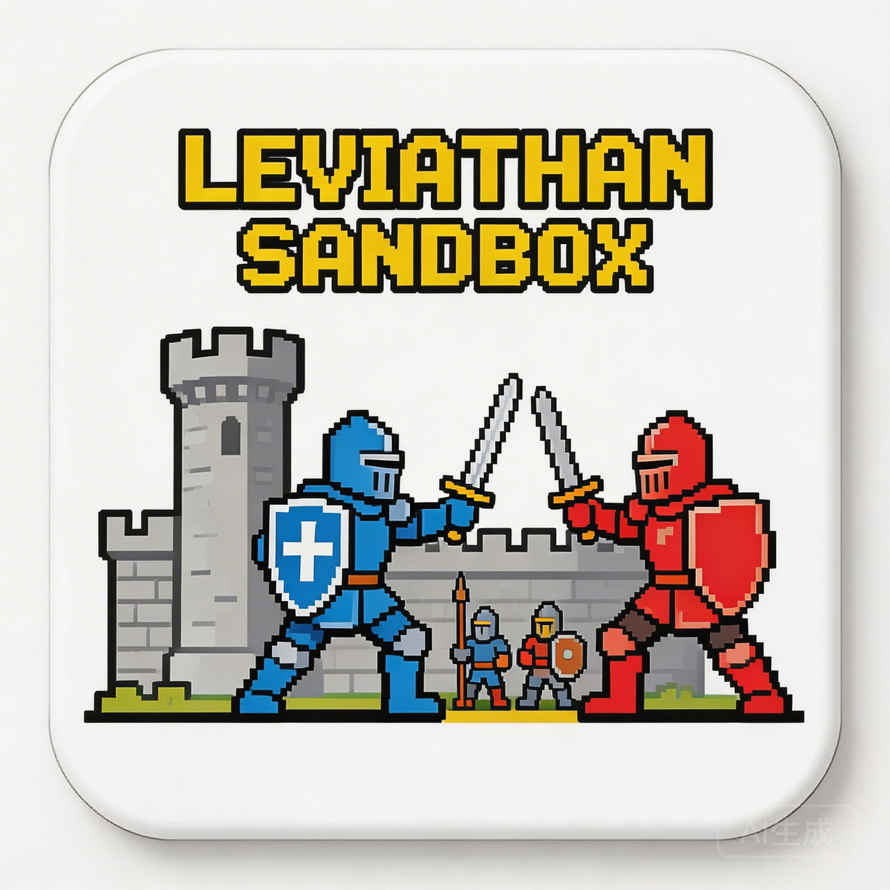

# Leviathan Sandbox (利维坦沙箱)

<div align="center">
  
  <br>
  <em>An AI-Driven RTS Sandbox with Automated Asset Generation</em>
</div>

## 🎮 Introduction

Leviathan Sandbox is a turn-based Real-Time Strategy (RTS) game playground designed for experimenting with AI agents and automated game asset pipelines.

- **Automated Assets**: All game units (Knights, Archers, Orcs, etc.) and animations are generated by AI (Seedream/Seedance) via a fully automated pipeline.
- **AI Agents**: Write strategies in Python or YAML, or use LLM-powered agents to command your troops.
- **Web Replay**: Watch battles in a smooth, interpolated HTML5 viewer.

## 🚀 Quick Start (One-Liner)

**No Git required! Just copy & paste:**

```bash
curl -sSL https://raw.githubusercontent.com/your-username/leviathan-sandbox/main/setup_remote.sh | bash
```

After installation:
```bash
cd leviathan-sandbox
./start.sh battle --opponent siege --render
```

---

## 🛠 Git Installation

If you prefer git:

```bash
git clone https://github.com/your-username/leviathan-sandbox.git
cd leviathan-sandbox
./install.sh
```

---

## 🛠 Manual Installation

### 1. Setup

```bash
# Install package in editable mode
pip install -e .
```

### 2. Run a Battle

Use the CLI to start a fight instantly:

```bash
# Quick battle against a Siege bot
leviathan-sandbox battle --opponent siege --render

# Custom AI Battle (Requires API Key)
export ARK_API_KEY="your-key"
leviathan-sandbox battle --my-prompt "Rush with mass Goblins" --opponent "aggressive" --render
```

### 3. Watch the Replay

Start the web viewer:

```bash
cd web
python3 -m http.server 8001
```

Open [http://localhost:8001/](http://localhost:8001/) in your browser and select the generated `.json` file.

## 🎮 How to Play

### 1. Command Your Army (CLI)

After installation, use the `battle` command to start a fight.

**Quick Match:**
Play against a built-in "Siege" bot that uses Turrets and Catapults.
```bash
./start.sh battle --opponent siege --render
```

**Custom AI Strategy (The Fun Part):**
If you have a VolcEngine API Key (or OpenAI-compatible key), you can command your army using natural language!

```bash
export ARK_API_KEY="your-api-key"

# Example: Rush Strategy
./start.sh battle --my-prompt "Ignore defense! Spawn mass Knights and Archers in the middle lane. Rush the enemy base!" --opponent aggressive --render

# Example: Defensive Strategy
./start.sh battle --my-prompt "Build a wall of Turrets and protect them with Orcs. Use Catapults to snipe from afar." --opponent siege --render
```

### 2. Watch the Action

The battle simulation runs in seconds, but you can watch the replay in two ways:

**A. Video File (MP4)**
The CLI will output a video file path (e.g., `replays/battle_12345.mp4`). Open it with any media player.

**B. Interactive Web Viewer**
For a better experience with tooltips and stats:
```bash
cd web
python3 -m http.server 8001
```
Open [http://localhost:8001/](http://localhost:8001/) and load the `.json` file from the `replays/` folder.

## 🛠️ Features

### Gameplay
- **Grid**: 24x3 battlefield.
- **Units**: Knight (Tank), Archer (DPS), Goblin (Swarm), Orc (Brute), Catapult (Siege).
- **Buildings**: Wall (Defense), Turret (Static DPS), Base (HQ).
- **Resources**: Mana regenerates over time.

### Asset Pipeline
We use VolcEngine's Seedream (Image) and Seedance (Video) models to create game assets.

To generate/regenerate assets:
```bash
# Set your API Key
export ARK_API_KEY="your-key"

# Run pipeline
python3 tools/asset_pipeline/pipeline.py
```

## 🤖 Developer Guide (Trae Skills)

This project includes built-in skills for the Trae IDE (or other agentic workflows) in `.trae/skills/`:

- `leviathan-setup`: Environment configuration guide.
- `leviathan-architecture`: Codebase structure overview.
- `leviathan-create-unit`: How to add new units (Prompt -> Logic -> Frontend).
- `leviathan-gameplay`: Detailed rules and bot writing guide.

## 📄 License

This project is licensed under the **CC BY-NC 4.0** (Creative Commons Attribution-NonCommercial 4.0 International).

- ✅ **Share**: Copy and redistribute the material in any medium or format.
- ✅ **Adapt**: Remix, transform, and build upon the material.
- 🚫 **NonCommercial**: You may not use the material for commercial purposes.
