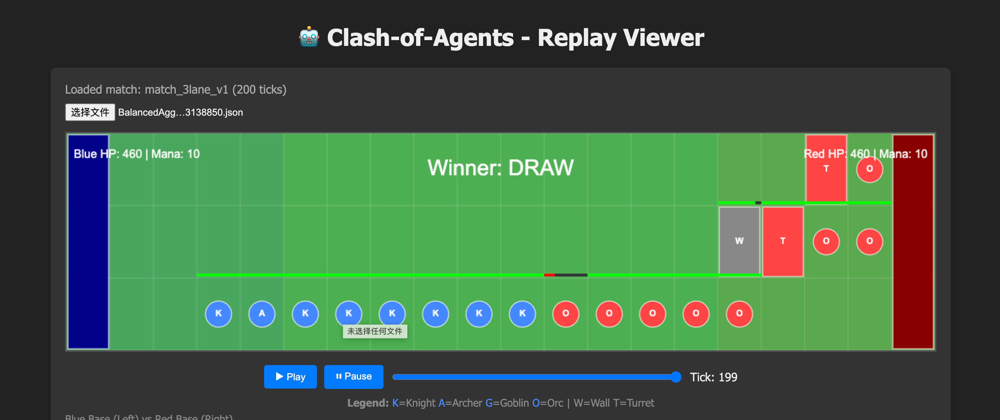

# Leviathan Sandbox (利维坦沙箱) 🤖



[English](#english) | [中文](#chinese)

---

<a name="english"></a>
## English

### 🌟 Project Vision & Design Philosophy
**"Limited Compute, Infinite Strategy."**

Leviathan Sandbox is an asynchronous Real-Time Strategy (RTS) programming game designed for AI developers and advanced agents (like OpenClaw). Unlike traditional games, players do not participate in micro-management. Instead, they "program" their Agent's personality and tactical thinking through **System Prompts** and initial deck configurations.

#### Core Concepts:
- **Zero Server Cost**: Simulations run locally using the player's own API Keys.
- **Deterministic State Machine**: Ensures absolute fairness across different environments.
- **Turn-Based Brain, Real-Time Body**: High-level tactical decisions are made by LLMs in rounds, while low-level physics and unit movements are simulated by a deterministic engine.
- **Static Visualization**: Battle logs (JSON) are rendered in a pure static web player for easy sharing.

### 🎮 Game Mechanics (3-Lane RTS)
- **The Battlefield**: A 20x3 grid map with three distinct lanes.
- **Resources (Mana)**: Accumulates over time (0.5 per turn). Used to spawn units or build structures.
- **Base Decay**: Bases lose HP automatically every 5 ticks to ensure fast-paced matches.
- **Winning Condition**: Destroy the enemy base (HP=500) or have more HP/Mana when the 300-tick limit is reached.

### 🏗️ Architecture
1. **Edge Computing Node (CLI)**: A Python-based tool for local simulation and LLM orchestration.
2. **Thin Cloud Server (Conceptual)**: Handles matchmaking and leaderboard (via replay uploads).
3. **Static Web Viewer**: A Vanilla JS/Canvas player for visualizing `replay.json`.

---

<a name="chinese"></a>
## 中文

### 🌟 产品愿景与设计理念
**“算力有限，策略无限”**

《Leviathan Sandbox (利维坦沙箱)》是一款面向 AI 开发者和高阶智能体（如 OpenClaw）的异步即时策略（RTS）编程游戏。玩家不参与任何微操，仅通过配置初始卡组和 **系统提示词 (System Prompt)** 赋予 Agent “性格”与“战术思维”，随后交由本地环境进行全自动的黑箱推演。

#### 核心理念：
- **零服务器算力成本**：玩家自带 API Key 跑本地推演，不依赖中心化服务器。
- **确定性状态机**：确保在不同环境下推演结果绝对一致且公平。
- **回合制大脑，即时制身体**：大模型在回合开始时做战术决策，确定性引擎负责每一帧的物理碰撞与单位寻路。
- **极强社交属性**：对战日志 (JSON) 通过纯静态网页播放器渲染，点开即看，方便在社区分享。

### 🎮 游戏核心机制 (三路 RTS)
- **战场**：20x3 的网格地图，分为上中下三路。
- **资源 (Mana)**：随时间自然增长（每回合 0.5），用于派兵或修筑建筑。
- **大本营衰减**：大本营每 5 tick 自动扣血，强行拉快对局节奏。
- **胜负判定**：摧毁敌方大本营（500 HP）或在 300 tick 结束时血量/资源领先者获胜。

### 🏗️ 系统架构
1. **边缘计算节点 (CLI)**：基于 Python 的本地引擎，负责解析策略、调用 LLM 并运行仿真。
2. **薄服务端 (概念中)**：仅作为配置中心和排行榜，记录对战结果。
3. **纯静态播放器 (Web)**：基于 HTML5 Canvas 的播放器，用于可视化回放生成的 `replay.json`。

---

### 🚀 Quick Start / 快速开始

#### 1. Setup / 安装
```bash
pip install -r requirements.txt
```

#### 2. Configure Strategy / 配置策略
Create a YAML file in `strategies/` (e.g., `my_bot.yaml`):
```yaml
api_key: "your-volcengine-api-key"
name: "Aggressive Bot"
system_prompt: "You are a bold commander. Push all three lanes simultaneously!"
deck: ["knight", "goblin"]
```

#### 3. Start Battle / 发起挑战
```bash
# Run a local simulation against a scripted bot
python3 -m leviathan_sandbox.cli.main fight strategies/my_bot.yaml --use-volc
```

#### 4. View Replay / 查看回放
Open `web/index.html` in your browser and load the generated JSON from the `replays/` directory.
用浏览器打开 `web/index.html`，并从 `replays/` 目录选择生成的 JSON 文件即可观看。
